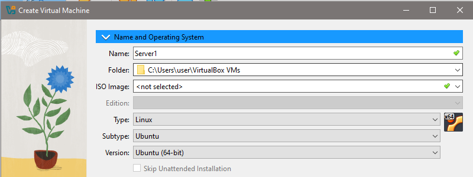
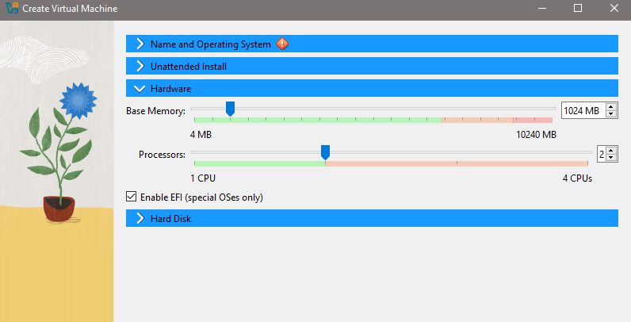
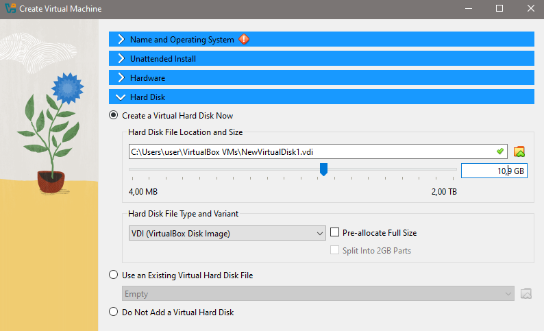
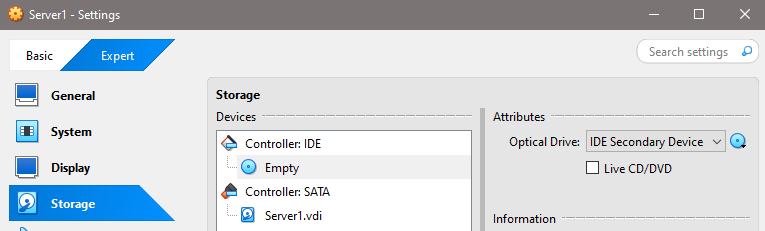

## 🔄 Membangun Load Balancer Real-Time pada Sistem Terdistribusi dengan Socket Programming

## PROFIL

|  |  |
| -------- | --- |
| **Nama** | Muhammad Faiz Iqbal |
| **Kelas** | TI.23.A.5 |
| **Mata Kuliah** | Pemrograman Web 2 |
| **Dosen Pengampu** | Agung Nugroho S.kom, M.kom |
---

## 💡 Deskripsi Proyek
Proyek ini merupakan bagian dari eksperimen tugas mata kuliah Sistem Terdistribusi dan juga diadaptasi untuk artikel Pemrograman Web. Tujuan utama eksperimen ini adalah membangun sebuah sistem sinkronisasi database terdistribusi menggunakan pendekatan socket programming di Python, serta menerapkan load balancer untuk mengarahkan koneksi klien ke server yang aktif secara real-time.

Sistem terdiri dari 4 server Ubuntu (dijalankan melalui VirtualBox), masing-masing menjalankan aplikasi web berbasis Flask. Sebuah script load balancer (load_balancer.py) bertugas menerima koneksi dari klien dan meneruskan request ke salah satu server yang aktif. Jika salah satu server mati, maka koneksi akan otomatis dialihkan ke server lain tanpa mengganggu pengguna.

Eksperimen ini menggambarkan bagaimana komunikasi real-time antar server bisa dibangun dengan socket programming, dan bagaimana konsep ini berkaitan erat dengan teknologi WebSocket dalam pengembangan aplikasi web real-time.

---

## 🛠️ Cara Menjalankan
1. Jalankan server Flask di setiap server VM:
```
python3 web_server.py
```
2. Jalankan script load balancer:
```
python3 load_balancer.py
```
3. Jalankan client (jika menggunakan script client):
```
python3 client.py
```
4.  Memindahkan Aplikasi Web ke Server Ubuntu
```
# Menggunakan scp (ganti dengan IP server dan lokasi file)
scp -r /path/to/your/web/* username@server_ip:/var/www/html/
```
5. Konfigurasi Nginx sebagai Reverse Proxy
```
sudo nginx -t  # Cek konfigurasi
sudo systemctl restart nginx
```
6. Membuat Layanan Systemctl
```
# Di setiap server web
sudo systemctl enable web-server
sudo systemctl start web-server

# Di server load balancer
sudo systemctl enable load-balancer
sudo systemctl start load-balancer
```

---
## 📸 Screenshots (Opsional)







---

## 📚 Referensi

* Python Socket Documentation:
https://docs.python.org/3/library/socket.html

* Flask Documentation:
https://flask.palletsprojects.com/

* Artikel terkait WebSocket: 
https://developer.mozilla.org/en-US/docs/Web/API/WebSocket

* Implementasi Socket Programming Sebagai Media
Sinkronisasi Database Terdistribusi dengan Teknik Multi Master Replication
https://jsi.stikom-bali.ac.id/index.php/jsi/article/view/271

---

## SELESAI  

- Email: mfaiziqbal01@gmail.com

 